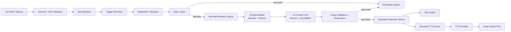

# Fluxo Chat → AI → TTS

```mermaid
flowchart LR
    Chat[YouTube / Manual] --> V1[Schema + Size Validation]
    V1 --> N[Normalization]
    N --> Tr[Trigger Detection]
    Tr --> M[Moderation / Blocklist]
    M --> R[Rate Limiter]
    R -->|admitido| Q1[Bounded Request Queue]
    R -->|recusado| Safe[Resultado seguro]
    Q1 --> C[Context Builder\nallowlist + session]
    C --> A[AI Provider Port\ntimeout + cancellation]
    A --> O[Output Validation / Moderation]
    O -->|aprovado| Q2[Bounded Response Queue]
    O -->|reprovado| Safe
    Q2 --> Txt[Text Output]
    Q2 --> QT[Bounded TTS Queue]
    QT --> T[TTS Provider]
    T --> Audio[Audio Output Port]
```

`correlationId`, `sessionId`, timeout e cancellation acompanham a operação. Resultado tardio, cancelado ou de outra sessão não é publicado.
