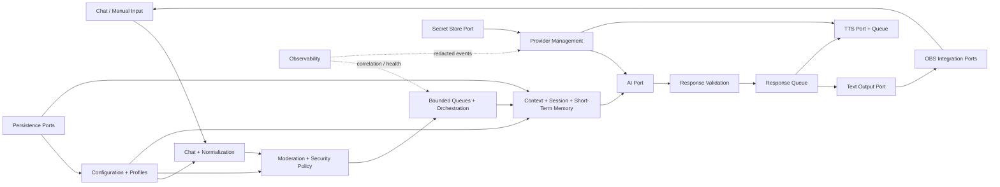

# C4 — Component View do Assistant Core

```mermaid
flowchart LR
    Inputs[Chat / Manual Input] --> Chat[Chat + Normalization]
    Chat --> Security[Moderation + Security Policy]
    Security --> Queues[Bounded Queues + Orchestration]
    Queues --> Context[Context + Session + Short-Term Memory]
    Context --> AI[AI Port]
    AI --> OutputCheck[Response Validation]
    OutputCheck --> Responses[Response Queue]
    Responses --> Text[Text Output Port]
    Responses --> TTS[TTS Port + Queue]

    Config[Configuration + Profiles] --> Chat
    Config --> Security
    Config --> Context
    Providers[Provider Management] --> AI
    Providers --> TTS
    Persistence[Persistence Ports] --> Config
    Persistence --> Context
    Secrets[Secret Store Port] --> Providers
    Obs[OBS Integration Ports] --> Inputs
    Text --> Obs
    Observability[Observability] -. correlation / health .-> Queues
    Observability -. redacted events .-> Providers
```

As setas representam dependências/fluxo conceitual, não referências proibidas entre projetos físicos.
