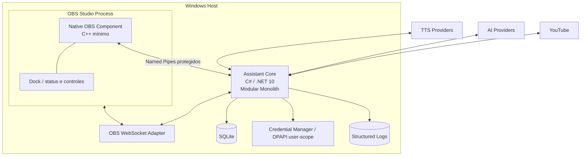

# C4 — Container View

```mermaid
flowchart TB
    subgraph Windows[Windows Host]
        subgraph ObsProc[OBS Studio Process]
            Plugin[Native OBS Component\nC++ mínimo]
            Dock[Dock / status e controles]
            Plugin --- Dock
        end
        Core[Assistant Core\nC# / .NET 10\nModular Monolith]
        Ws[OBS WebSocket Adapter]
        Db[(SQLite)]
        Cred[Credential Manager / DPAPI user-scope]
        Logs[(Structured Logs)]
        Plugin <-->|Named Pipes protegidos| Core
        Core <--> Ws
        Ws <--> ObsProc
        Core --> Db
        Core --> Cred
        Core --> Logs
    end
    YouTube[YouTube] <--> Core
    AI[AI Providers] <--> Core
    TTS[TTS Providers] <--> Core
```

O processo OBS contém somente a capability inevitavelmente nativa; o Core possui negócio, dados e providers.
