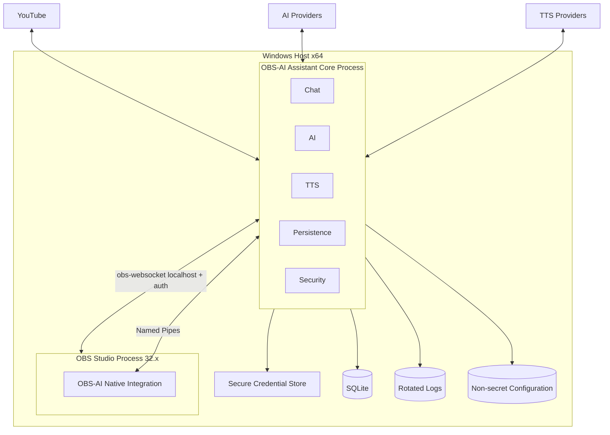

# Deployment View

```mermaid
flowchart TB
    subgraph Host[Windows Host x64]
        subgraph OBS[OBS Studio Process 32.x]
            Plugin[OBS-AI Native Integration]
        end
        subgraph Core[OBS-AI Assistant Core Process]
            Chat[Chat]
            AI[AI]
            TTS[TTS]
            Persist[Persistence]
            Sec[Security]
        end
        Plugin <-->|Named Pipes| Core
        Core <-->|obs-websocket localhost + auth| OBS
        Cred[Secure Credential Store]
        Db[(SQLite)]
        Logs[(Rotated Logs)]
        Config[(Non-secret Configuration)]
        Core --> Cred
        Core --> Db
        Core --> Logs
        Core --> Config
    end
    ExtChat[YouTube] <--> Core
    ExtAI[AI Providers] <--> Core
    ExtTTS[TTS Providers] <--> Core
```

O installer futuro trata plugin, Core e dados como componentes distintos e nunca substitui binários carregados pelo OBS.
