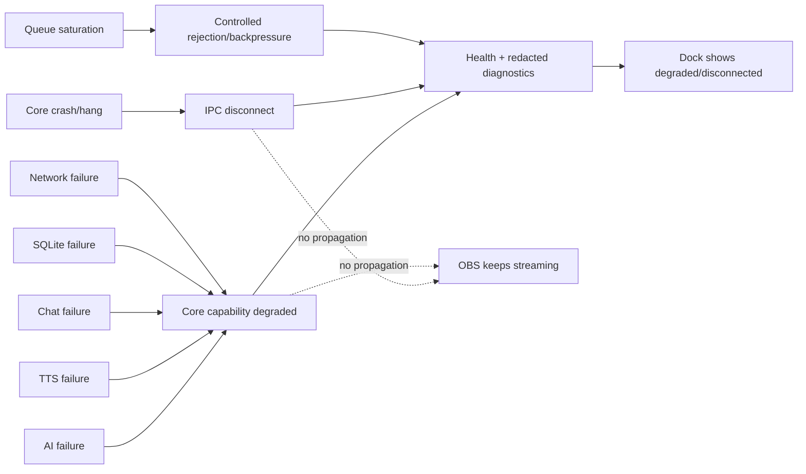

# Failure Isolation

| Evento | Contenção | Recuperação |
|---|---|---|
| Core crash/hang | process boundary + IPC loss | restart/reconnect explícito; nova sessão |
| provider timeout/quota | timeout, cancel e retry limitado | backoff; ação do streamer quando necessário |
| DB lock/corruption | adapter falha sem sucesso silencioso | health/integrity + recovery/backup |
| queue saturation | capacidade finita | recusa/descarte observável; capacidade liberada |
| shutdown | fecha entrada e cancela trabalho | sem publicar resultados tardios |

Nenhum mecanismo reinicia automaticamente uma saída ambígua ou reduz controles para “continuar funcionando”.
