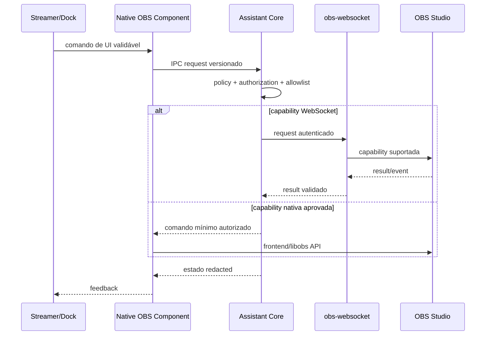

# Fluxo de integração OBS

## Matriz de responsabilidades

| Capacidade | Native Component | obs-websocket | Assistant Core |
|---|---:|---:|---:|
| Dock e frontend lifecycle | Responsável | Não suporta | Estado e commands de UI |
| Source de áudio customizada | Somente se ADR-006 validado | Não suporta | Gera/entrega buffers aprovados |
| Estado, scenes, sources e events expostos | Evitar duplicação | Preferido | Policy + adapter |
| Autorização de ação sensível | Enforce contrato recebido | Transporte autenticado | Responsável, deny-by-default |
| Providers, moderação, persistência, secrets | Proibido | Não aplicável | Responsável |
| Health | Estado local/IPC | Capability/connection | Estado agregado |

