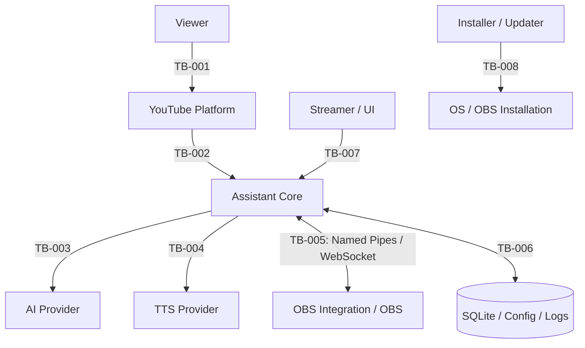

# Security Boundaries

| Boundary | Controles mínimos |
|---|---|
| TB-001/002 | normalização, tamanho, moderação, rate limit, OAuth scopes/quotas |
| TB-003/004 | credential reference, TLS/destino, timeout, minimização e output validation |
| TB-005 | DACL/auth, versão, allowlist, authorization, backpressure e fail closed |
| TB-006 | ACL, validation, integrity, recovery, retention e secrets separados |
| TB-007 | validation, confirmation e masking; AI output não herda autoridade |
| TB-008 | signing/hash, least privilege, compatibilidade, rollback e escopo explícito |

“Local” e “provider oficial” não concedem confiança automática.
