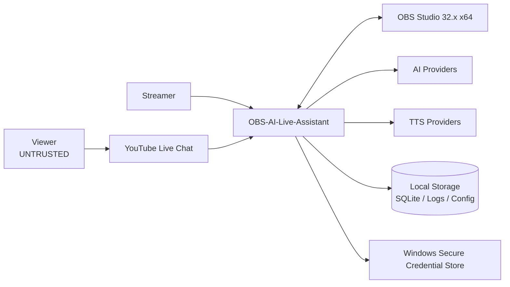

# C4 — System Context

```mermaid
flowchart LR
    Viewer[Viewer\nUNTRUSTED] --> YouTube[YouTube Live Chat]
    Streamer[Streamer] --> System[OBS-AI-Live-Assistant]
    YouTube --> System
    System <--> OBS[OBS Studio 32.x x64]
    System --> AI[AI Providers]
    System --> TTS[TTS Providers]
    System --> Local[(Local Storage\nSQLite / Logs / Config)]
    System --> Secrets[Windows Secure Credential Store]
```

O sistema local recebe conteúdo não confiável, aplica controles e integra o OBS sem tornar a live dependente de providers ou do Core.
